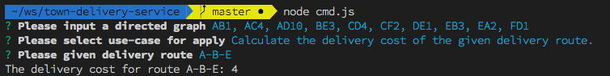
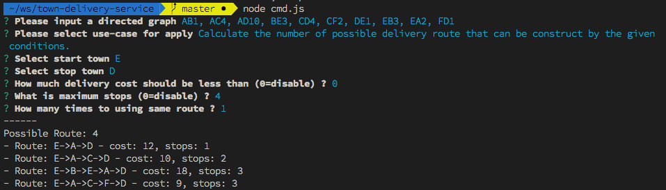
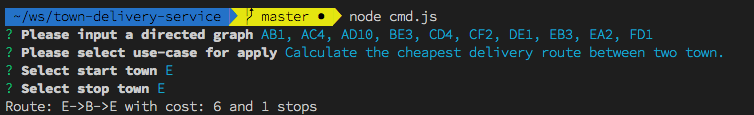

# NodeJS - Town Delivery Service


Star City decide to introduce a new delivery services to the market in order to support growth of
E-commerce business in Thailand. Due to innovative nature of the company, the ways to use their
service is very innovative one.

To use Star City Delivery Service, their customers have to define the delivery route by themselves.
They can construct it by choosing multiple routes between two towns that Star City provided.
The delivery cost is equal to the summation of these routes that they choosed.
Each routes in the list is only ‘one-way’, That is, a route from town A to town B does not imply the
existence of a route from town B to town A. Even if both of these routes do exist, they are distinct and
are not necessarily have the same cost.

The purpose of this assignments is to help Star City building the system that provide their customers with
information about delivery route. you will compute the delivery cost of a certain route, the number of
possible delivery route between two towns, and the cost of cheapest delivery route between two
towns.
## Features
- Calculate the delivery cost of the given delivery route



- Calculate the number of possible delivery route that can be construct by the given conditions.



- Calculate the cheapest delivery route between two town.


## Usages
```
node cmd.js
```

## Route Mapping Example
```
AB1, AC4, AD10, BE3, CD4, CF2, DE1, EB3, EA2, FD1
```

## Support (OS Terminals)
see more details on [inquirer.js](https://github.com/SBoudrias/Inquirer.js)

#### Mac OS:
- Terminal.app
- iTerm

#### Windows:
- ConEmu
- cmd.exe
- Powershell
- Cygwin

#### Linux (Ubuntu, openSUSE, Arch Linux, etc):
- gnome-terminal (Terminal GNOME)
- konsole


## Development

### Unit Tests
- required `mocha` to be installed with `npm install`

- Run Unit tests with below command
```
npm run test
```